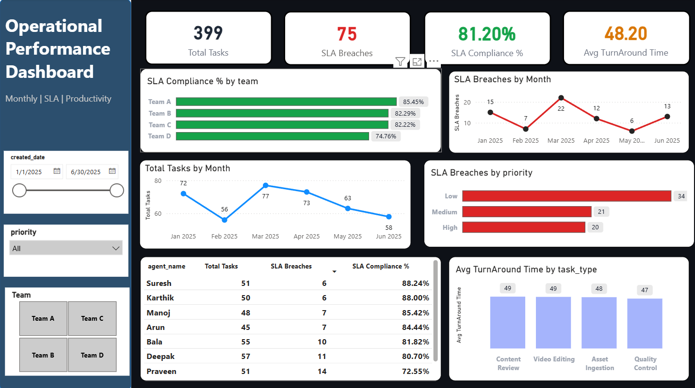

# Operations SLA Analytics

An interactive Power BI dashboard that measures SLA performance, productivity and turnaround time for an operations team, and surfaces where and when breaches happen.

> Project 2 of the Arrowstack Data Analytics internship.



## Business problem
Operations managers need visibility into whether tasks are completed within SLA, which teams, agents and priorities are driving breaches, and how performance changes month to month, so they can act on it.

## Key KPIs
| KPI | Definition | Result |
|---|---|---|
| Total Tasks | Count of tasks in the selected period | 399 |
| SLA Breaches | Tasks that exceeded their SLA | 75 |
| SLA Compliance % | (Total Tasks − Breaches) / Total Tasks | 81.20% |
| Avg Turnaround Time | Mean turnaround time per task | 48.20 |

## Key insights
- **Team gap:** Team A leads at 85.45% compliance; Team D trails at 74.76%.
- **March spike:** Highest volume (77 tasks) and most breaches (22).
- **Priority:** Low-priority tasks account for the most breaches (34 of 75).
- **Agents:** Compliance ranges from 88.24% (Suresh) to 72.55% (Praveen).
- **Task types:** Average turnaround is similar across types (47–49), so delays are not driven by task type.

## Recommended actions
1. Review workload and processes in Team D and share Team A's practices.
2. Plan extra capacity ahead of peak months like March.
3. Revisit how low-priority tasks are queued so they don't sit until they breach.
4. Provide targeted coaching or rebalance workload for the lowest-compliance agents.

## Dashboard features
- Slicers for date range, priority and team
- SLA compliance by team; breaches by month and by priority
- Monthly task volume trend
- Agent-level performance table
- Avg turnaround time by task type

## Repository structure
```
├── data/        Operations_SLA_Performance_Data.xlsx
├── dashboard/   Operations SLA & Productivity Intelligence.pbix, Dashboard.png
├── docs/        requirements, KPI definitions, validation log
└── README.md
```

## Data validation
Checks performed before modelling: [duplicates, missing values, date formats, SLA flag consistency, etc.]

## How to reproduce
1. Clone this repository.
2. Open the `.pbix` file in Power BI Desktop.
3. If prompted, point the data source to `data/Operations_SLA_Performance_Data.xlsx` and refresh.

## Limitations & next steps
- Covers only six months of data, so seasonality can't be confirmed.
- No root-cause field, so breach reasons can't be analysed yet.
- Next: add SQL-based data prep, root-cause categories, and automated refresh.

## Tools
Power BI · Excel# Operations_SLA_Analytics